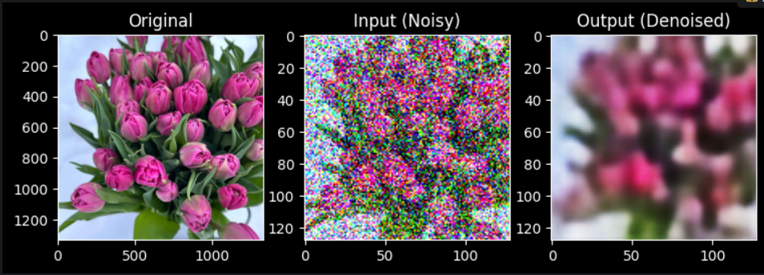
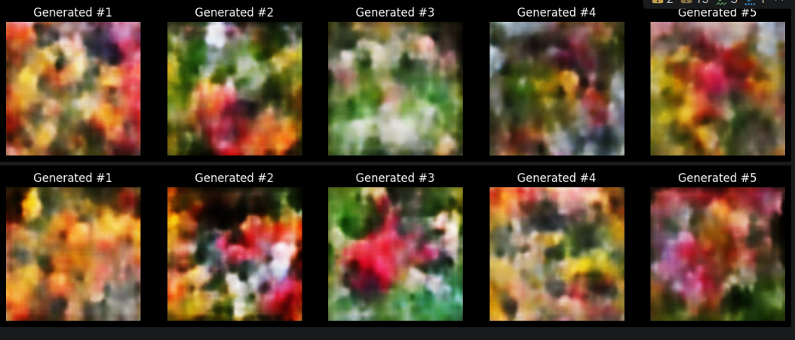

# Deep Learning Research: Image Classification & Generative Models


## Project Overview
This repository contains a comprehensive study of Deep Learning techniques applied to Computer Vision tasks. The project evolves from training a **custom CNN** from scratch to implementing advanced **Transfer Learning** strategies and exploring **Generative AI** concepts using Autoencoders.

The goal was to analyze how different architectures, loss functions (MSE vs L1), and regularization techniques impact model performance and image reconstruction quality.

---

## Research Objectives
The project was designed to fulfill the following technical requirements:
1.  **Baseline Modeling:** Develop and train a custom Convolutional Neural Network (CNN) from scratch.
2.  **Transfer Learning Analysis:** Compare **Feature Extraction** vs. **Fine-Tuning** using state-of-the-art architectures (**ResNet18**, **DenseNet121**).
3.  **Data Optimization:** Implement advanced Data Augmentation (Rotation, Flipping, Color Jitter) to prevent overfitting.
4.  **Generative Tasks:**
    * Build a **Denoising Autoencoder** to restore clean images from noisy inputs.
    * Develop a **Variational Autoencoder (VAE)** to generate new synthetic image samples.

---

## Key Results & Visualizations

### 1. Denoising Autoencoder
*Restoring clean images from inputs with added Gaussian noise.*
<p align="center">
  
</p>

### 2. Variational Autoencoder (VAE) Generation
*Generating new flower samples from the latent space using L1 Loss for sharper details.*
<p align="center">
  
</p>

---

## Installation & Usage

1. **Clone the repository:**
   ```bash
   git clone [https://github.com/GoldenSalm0n/Deep-Learning-Image-Classification.git](https://github.com/GoldenSalm0n/Deep-Learning-Image-Classification.git)
   cd Deep-Learning-Image-Classification


